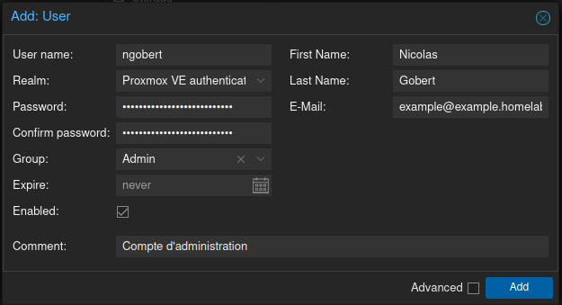
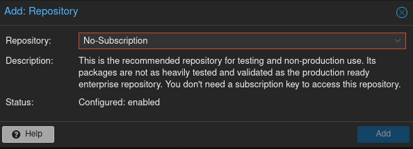
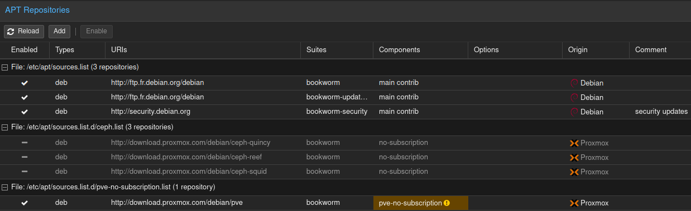
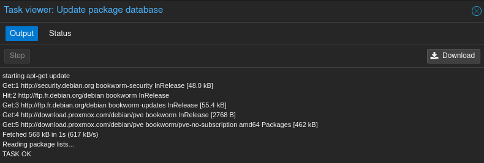
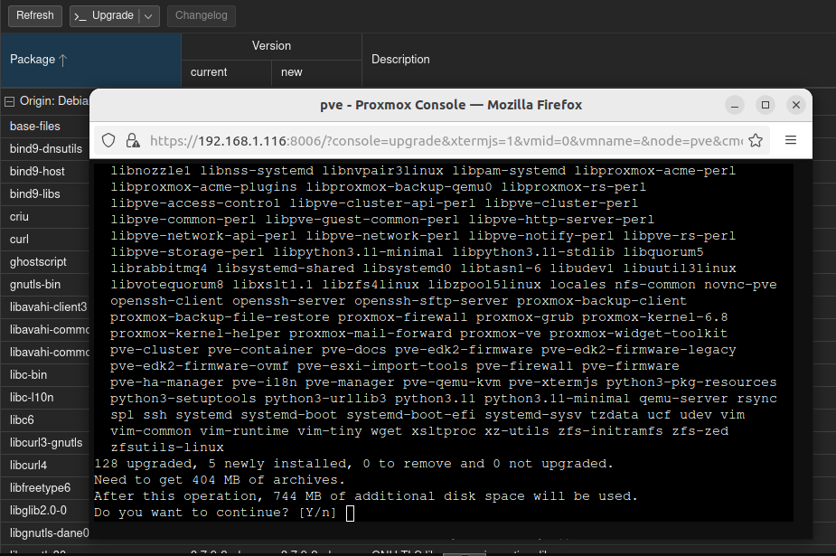
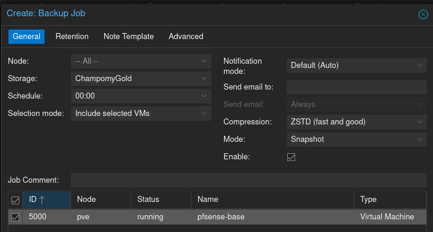
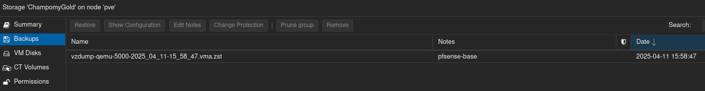
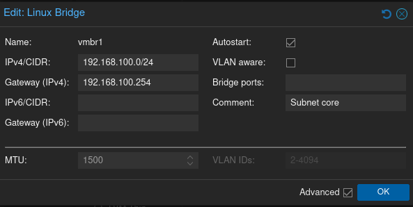

> Ce document contient les livrables issus de la phase d'installation et de configuration de Proxmox VE ainsi que des sous-réseaux au sein du homelab. Ces éléments constituent la base (le core) de notre infrastructure.

---

# 1. Installation de Proxmox VE

Proxmox VE (Virtual Environment) est un hyperviseur de type 1 et open source. Cette solution offre de nombreuses fonctionnalités en parfaite cohérence avec les besoins du homelab. Voici un tableau récapitulatif non exhaustif de ces dernières :

| Fonctionnalités      | Description      |
|:-:    |---    |
| Prise en charge complète de la virtualisation avec KVM     | Support de la virtualisation de machines QEMU/KVM     |
| Prise en charge des conteneurs LXC     | Conteneurisation légère et native sous Linux    |
| Interface web     | Interface web qui permet d'interragir avec les éléments de gestion liés à Proxmox VE ainsi que les VM et les containers     |
| Cluster     | Gestion centralisée du cluster dans le cas où plusieurs nodes sont présents    |
| HA     | Possibilité de configurer des bascules automatiques pour assurer la continuité de service     |
| Snapshots et sauvegarde     | Gestion des snapshots et des sauvegardes    |
| API REST    | Automatisation avec l'intégration de l'API REST    |

J'ai récupéré une image ISO sur le [site officiel de Proxmox](https://www.proxmox.com/en/) et j'ai rendu une clé USB bootable avec l'image récupérée. Je ne vais pas détailler l'installation de Proxmox VE, de nombreux guides existent et le programme d'installation fournit par Proxmox est clair et efficace.

---

# 2. Configuration de base de Proxmox VE

## 2.1. Création d'un utilisateur d'administration

La première étape est de créer un utilisateur appartenant au groupe "Admin" afin de pouvoir se connecter via le Realm "Proxmox VE authentication server" et non pas avec l'utilisateur standard "root" via "Linux PAM". Pour cela, il faut être dans la vue "Server View", cliquer sur "Datacenter", se rendre dans la section "Permissions", puis "Users" et enfin cliquer sur le bouton "Add".



Il est important d'ajouter le groupe "Admin" dans la section "Group" afin que notre utilisateur puisse disposer de toutes les permissions nécessaires.

## 2.2. Configuration des dépôts pour les mises à jour

Par défaut, sur une installation fraîche de Proxmox VE, des dépôts dans la section "Updates" puis "Repositories" pointent vers des URL adaptées pour la version Entreprise. 
Il est nécessaire de désactiver les dépôts qui pointent vers des dépôts Entreprise et d'activer les dépôts "no-subscription" en cliquant sur "Add" et en sélectionnant "No-Subscription" dans le menu déroulant.



Voici la configuration que j'obtiens après ces manipulations. A noter, que j'ai désactivé également les dépôts Ceph car ce n'est pas une fonctionnalité que j'utilise dans mon homelab pour le moment.



A présent, il ne reste plus qu'à rafraîchir le contenu du cache du gestionnaire de package côté système de Proxmox VE en cliquant sur "Updates" puis "Refresh".



C'est l'équivalent d'un `sudo apt update` sur une GNU/Linux Debian par exemple.

Enfin, pour mettre à jour les paquets remontés par le refraîchissement précédemment effectué, il est nécessaire de se connecter en tant que root ou via un utilisateur appartenant au groupe `sudo` (ce qui n'est pas le cas lorsque l'on a une installation par défaut de Proxmox VE) via le Realm PAM. Une fois que l'on clique dur "Update" une fenêtre console du système apparaît et nous demande confirmation. C'est comme si nous faisions un `sudo apt upgrade` directement via la cli.



Il est important de faire les opérations d'upate et d'upgrade régulièrement pour maintenir le système de Proxmox VE à jour. C'est tout aussi simple de passer directement via la cli `apt update && apt upgrade -y`. Il est possible d'envisager de créer un cron pour exécuter cette action régulièrement.

## 2.3. Mise en place de la sauvegarde

J'ai un serveur NAS Synology sur lequel j'ai ajouté un répertoire partagé sur le réseau appelé "Proxmox_backups". Pour l'ajouter au niveau de Proxmox VE, il faut se rendre dans la section "Storage", cliquer sur "Add, sélectionner le type "SMB" et renseigner les informations nécessaires (IP, nom d'utilisateur, mot de passe et le nom du répertoire partagé). Je choisi d'inclure les "Disk images", "VZDump backup file" et "Container".

Pour que les sauvegardes fonctionnent, il faut à présent ajouter une politique de sauvegarde pour cela on se rend dans le menu "Backups" puis on clique sur "Add". Je choisi de mettre en place une programmation des sauvegardes tous les jours à minuit et d'appliquer la politique de sauvegarde sur l'unique VM que j'ai pour le moment. Tant que la création de VM n'est pas automatisée, il faudra penser à activer la sauvegarde pour chaque VM que l'on souhaite (celles du core). Concernant la rétention, je choisi de conserver les 5 dernières sauvegardes.



Il est tout à fait possible de tester notre configuration en exécutant le job de sauvegarde maintenant grâce au bouton "Run now". Une fois fait, il faut se rendre au niveau du storage de sauvegarde pour observer le résultat.



## 2.4. Désactivation du message concernant l'absence de licence valide

Si l'on ne dispose pas d'une licence valide pour Proxmox Entreprise, à chaque connexion une popup d'avertissement apparaîtra. Pour enlever ce comportement, il y a deux choix possibles. La première, acquérir une licence valide et l'associée à son cluster Proxmox VE et la seconde consiste à enlever le code responsable de cette apparition directement sur le serveur Proxmox VE. Nous allons procéder à la seconde méthode.

```bash
# Sauvegarde du fichier avant modification
cp /usr/share/javascript/proxmox-widget-toolkit/proxmoxlib.js /usr/share/javascript/proxmox-widget-toolkit/proxmoxlib.js.bak
```

```bash
# Modification du fichier
vim /usr/share/javascript/proxmox-widget-toolkit/proxmoxlib.js
```

Il faut que l'on modifie la ligne suivante `.data.status.toLowerCase() !== 'active') {` avec ce code-ci `.data.status.toLowerCase() !== 'active') { orig_cmd(); } else if ( false ) {`

Enfin, il ne nous reste plus qu'à relancer le service `pveproxy`

```bash
systemctl restart pveproxy
```

---

# 3. Réseau

Par défaut, une première interface est initialisée sur Proxmox, la `vmbr0`. Cette dernière est un bridge, c'est à dire qu'elle offre un accés par pont directement sur mon réseau local. L'objectif est de mettre en place deux interfaces supplémentaires `vmbr1` et `vmbr2`.

Pour réaliser ces opérations, il faut cliquer sur la section `pve` (nom de mon cluster Proxmox) et `Network`. Nous créons deux interfaces. `vmbr1` qui correspond au réseau `core` en 192.168.100.0/24 et `vmbr2` qui correspond au réseau `vms` en 192.168.200.0/24.

Voici un exemple de configuration avec `vmbr1`



Pour tester que cela fonctionne correctement, nous allons exécuter deux container alpine. Le premier container avec une interface réseau positionné sur `vmbr1` et le second sur `vmbr2`, puis nous allons installer le package `iputils-ping` pour disposer du ping et vérifier que nos container sont dans l'incapacité de communiquer entre eux.

