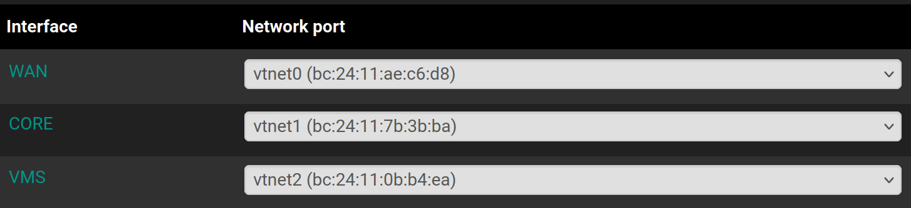

> Ce document contient les livrables issus de la phase d'installation et de configuration de pfSense. L'objectif est de pouvoir disposer d'une solution permettant de gérer simplement et efficacement les ouvertures réseaux entre les différents sous-réseaux du homelab mais également en provenance et à destination du WAN. L'occasion parfaite pour jouer un peu avec pfSense.

> La section `Règles` évolue au fur et à mesure de l'évolution du homelab

---

# 1. Installation de pfSense

Aprés avoir récupéré l'ISO de pfSense sur le site officiel, plus précisément sur le dépôt officiel car il faut s'inscrire pour obtenir l'ISO depuis le site. J'ai installé pfSense avec une configuration classique sans apporter de particularités majeures.

---

# 2. Configuration de pfSense

Ce que l'on souhaite, c'est l'association interfaces / réseau ci-dessous :

| Interface      | Réseau pfSense     | Sous-réseau | Adresse
|:-:    |:-:    |:-:    |:-:
| vmbr0     | WAN      | Réseau local (réseau local) | DHCP
| vmbr1     | CORE      | Réseau Core (homelab) | 192.168.100.254
| vmbr2     | VMS     | Réseau VMS (homelab) | 192.168.200.254

Il est important de désactiver les options `Block private networks and loopback addresses` et `Block bogon networks` car l'interface WAN se trouve sur un réseau local en 192.168.1.0/24.

Afin de rendre l'interface webgui de pfSense accessible depuis le WAN, il est nécessaire d'ajouter une règle au niveau de cette interface.

---

# 3. Règles

| Date     | Description    | 
|:-:    |:-:    |
| 04/06/2025     | Initialisation du tableau. Etat du homelab au chapitre 10, "Le coffre fort" |

