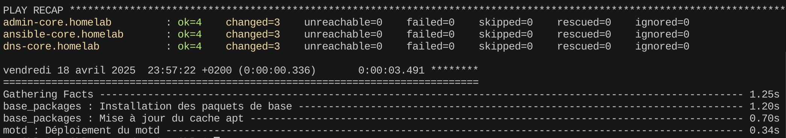
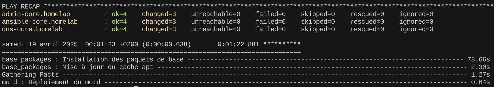

> Ce document contient les livrables issus de la phase d'installation et de configuration de la VM dédiée à Ansible `ansile-core`. L'objectif est de pouvoir disposer d'une VM pouvant exécuter des playbooks Ansible sur l'ensemble des VM sur homelab (core et vms).

---

# 1. Création de la VM

Nous allons utiliser le template `debian12-template` créé lors du chapitre 4. Sur Proxmox on créé un clone complet à partir de ce template. Voici les caractéristiques de la VM :

| OS      | Hostname     | Adresse IP | Interface réseau | vCPU    | RAM   | Stockage
|:-:    |:-:    |:-:    |:-:    |:-:    |:-:    |:-:
| Debian 12.10     | andible-core      | 192.168.100.250    | vmbr1 (core)    | 1     | 2048   | 20Gio

Il faut également penser à activer la sauvegarde automatique de la VM sur Proxmox en l'ajoutant au niveau de la politique de sauvegarde précédemment créée.

---

# 2. Modification mineure de l'OS

Modification de la configuration réseau avec le fichier `/etc/network/interfaces`

```bash
auto ens19
iface ens19 inet static
    address 192.168.100.250/24
    gateway 192.168.100.254
```

> __Un point important !__ Pendant la création du template `debian12-template` la désactivation de l'IPv6 n'a pas été faite. Il faut donc faire cela à la main pour chaque VM déployées et noter l'information quelque part pour ajouter cette configuration lorsque nous aurons Ansible pour le déploiement des VM.

Désactivation permanente de l'IPv6. Nous devons éditer ce fichier de configuration `/etc/sysctl.conf`

```bash
net.ipv6.conf.all.disable_ipv6 = 1
net.ipv6.conf.default.disable_ipv6 = 1
```

Enfin, nous devons recharger la configuration courante.

```bash
sudo sysctl -p
```

A présent, nous changons le hostname de la VM pour que ce soit `ansible-core.homelab`, puis nous modifions le contenu de son résolveur DNS local `/etc/hosts`

```bash
sudo hostnamectl set-hostname ansible-core.homelab
```

Nous allons maintenant modifier la configuration du résolveur DNS de la machine.

```bash
# Installation du daemon systemd-resolved
sudo apt install -y systemd-resolved

# Purge de resolvconf (obsolète)
sudo apt purge resolvconf

# Activation au démarrage du daemon systemd-resolved
sudo systemctl enable systemd-resolved --now

# Modification du fichier /etc/systemd/resolved.conf avec les éléments suivants
DNS=192.168.100.253
FallbackDNS=1.1.1.1
Domains=~.

# Restart du daemon systemd-resolved
sudo systemctl restart systemd-resolved

# Suppression du fichier /etc/resolv.conf
sudo rm /etc/resolv.conf

# Création du nouveau lien symbolique avec /etc/resolv.conf
sudo ln -s /run/systemd/resolve/stub-resolv.conf  /etc/resolv.conf
```

A présent, on peut tester que les résolutions DNS des noms de domaine interne `.homelab` ainsi que les noms de domaines externes fonctionnent correctement en passant par notre serveur DNS `dns-core.homelab` accessible via l'IP `192.168.100.253`

```bash
resolvectl status
Global
          Protocols: +LLMNR +mDNS -DNSOverTLS DNSSEC=no/unsupported
   resolv.conf mode: stub
 Current DNS Server: 192.168.100.253
         DNS Servers 192.168.100.253
Fallback DNS Servers 1.1.1.1
          DNS Domain ~.

Link 2 (ens19)
Current Scopes: LLMNR/IPv4
     Protocols: -DefaultRoute +LLMNR -mDNS -DNSOverTLS DNSSEC=no/unsupported
```

Enfin, on test quelques résolutions DNS avec notre nouvelle configuration

```bash
dig +short dns-core.homelab
192.168.100.253
```

```bash
dig +short google.com
216.58.214.78
```

> Il est important d'activer le résolveur DNS au niveau de pfSense. Pour les interfaces entrantes `CORE` et `VMS` puis pour l'interface sortante `WAN`.

---

# 3. Installation de Ansible

Nous commençons par installer les paquets nécessaire au bon fonctionnement de Ansible. Ici, nous allons installer Ansible avec pipx

```bash
sudo apt install -y python3 python3-pip python3-passlib pipx
```

Nous allons positionner notre environnement pipx au niveau de `/opt/ansible`

```bash
# Création du répertoire d'accueil pour Ansible
sudo mkdir -p /opt/ansible

# Modification de l'utilisateur et du groupe propriétaire sur /opt/ansible
sudo chown ansible:ansible /opt/ansible

# Initialisation de pipx
pipx ensurepath
# Prise en compte de l'init
source ~/.bashrc
```

Nous installons `Ansible` via pipx

```bash
# Ansible classique
pipx install --include-deps ansible

# Le lint de Ansible
pipx install ansible-lint
```

A ce stade, nous pouvons vérifier que `Ansible` est correctement installé appelant la commande ansible et en véirifiant la version

```bash
ansible --version
```

---

# 4. Configuration de Ansible

Création de la structure des répertoires représentatif des environnements `core` et `vms`

```bash
mkdir -p envs/100-core envs/200-vms
```

Création du fichier de configuration `ansible.cfg`

```bash
sudo tee /opt/ansible/ansible.cfg > /dev/null <<EOF
[defaults]
inventory = 100-core/00_inventory.yml
roles_path = roles
host_key_checking = False
retry_files_enabled = False
forks = 10
deprecation_warnings = False
stdout_callback = yaml
interpreter_python = auto_silent
callbacks_enabled = profile_tasks
pipelining = True
ssh_config = /home/ansible/.ssh/config

[privilege_escalation]
become = True
become_method = sudo
become_user = root
EOF
```

---

# 5. L'inventaire et les tests

Les premières actions à entreprendre sont, la création de la structure pour l'inventaire et l'initialisation du fichier d'inventaire avec les éléments que l'on a créé jusqu'à présent

```bash
mkdir /opt/ansible/envs/100-core/group_vars
mkdir /opt/ansible/envs/100-core/host_vars

#Fichier d'inventaire
touch /opt/ansible/envs/100-core/00_inventory.yml
```

Le fichier d'inventaire créé doit être structuré et composé avec les informations concernant nos serveurs actuels. Voici son contenu ci-dessous

```yml
all:
  children:
    debian:
      hosts:
        dns-core.homelab:
          ansible_host: 192.168.100.253
          hostname: dns-core

        admin-core.homelab:
          ansible_host: 192.168.100.252
          hostname: admin-core

        ansible-core.homelab:
          ansible_host: 192.168.100.250
          hostname: ansible-core

      vars:
        ansible_user: ansible
        ansible_python_interpreter: /usr/bin/python3
```

On test la communication entre notre serveur ànsible-core` et les managed-nodes via ansible

```bash
# Commande Anasible avec le module ping
ansible -i 00_inventory.yml all -m ping --one-line

# Retour
ansible-core.homelab | SUCCESS => {"changed": false,"ping": "pong"}
admin-core.homelab | SUCCESS => {"changed": false,"ping": "pong"}
dns-core.homelab | SUCCESS => {"changed": false,"ping": "pong"}
```

---

# 6. Premier rôles et playbook (installation de tmux)

Nous commençons par finaliser la structure du projet Ansible pour arriver à celle-ci

```bash
├── ansible.cfg
├── envs
│   ├── 100-core
│   │   ├── 00_inventory.yml
│   │   ├── group_vars
│   │   └── host_vars
│   └── 200-vms
├── playbooks
│   ├── playbook1
│   └── playbookX
└── roles
    ├── role1
    └── roleX
```

Nous créons les répertoires `playbooks`et `roles`. Puis nous allons initier deux roles avec la commande `ansible-galaxy`. Le premier role aura pour objectif d'installer les paquets de base et le second role va modifier le motd pour avoir des éléments utiles plus rapidement à disposition.

```bash
# Création des répertoires playbooks et roles
mkdir playbooks
mkdir roles

# Initialisation des roles avec ansible-galaxy
ansible-galaxy init roles/base_packages
ansible-galaxy init roles/motd
```

Dans un premier temps, nous nous concentrons sur le role `base_packages`. Nous éditons le fichier `roles/base_packages/tasks/main.yml

```yaml
#SPDX-License-Identifier: MIT-0
---
# tasks file for roles/base_packages
# Rôle permettant l'installation des paquets de base

- name: Mise à jour du cache apt
  ansible.builtin.apt:
    update_cache: yes
    cache_valid_time: 3600

- name: Installation des paquets de base
  ansible.builtin.apt:
    name:
      - curl
      - wget
      - tmux
      - htop
      - jq
      - tree
      - git
      - figlet
    state: present
```

Concernant le role `motd`, nous créons le fichier `roles/motd/templates/motd.j2`. Ce fichier au format jinja2 va nous permettre d'appliquer les variables utiles pour la formations du fichier que nous allons délivrer avec ce role.

```jinja2
########################################################
#   Hostname     : {{ ansible_hostname }}
#   IP Address   : {{ ansible_default_ipv4.address }}
#   Network Zone : {{ 'core' if 'core' in inventory_hostname else 'vms' if 'vms' in inventory_hostname else 'unknown' }}
#   Uptime       : {{ (ansible_uptime_seconds / 60) | int }} minutes
#   Disk Usage   : {{ ansible_mounts[0].size_available | human_readable }}/{{ ansible_mounts[0].size_total | human_readable }}
########################################################
```

Nous éditons le fichier `roles/motd/tasks/main.yml` avec les éléments ci-dessous

```yaml
#SPDX-License-Identifier: MIT-0
---
# tasks file for roles/motd
# Rôle permettant la modification du motd

- name: Déploiement du motd
  ansible.builtin.template:
    src: motd.j2
    dest: /etc/motd
    mode: '0644'
```

Pour finir, nous créons le playbook qui va permettre d'exécuter ces deux roles. On créer le fichier `playbooks/00_config_vm.yml` avec les éléments ci-dessous

```yaml
- name: Configuration de base d'une VM
  hosts: all
  become: true
  roles:
    - base_packages
    - motd
```

Enfin, pour que l'exécution du playbook se déroule correctement, il est primordial d'ajouter l'utilisateur `ansible` parmis les utilisateur pouvant élever ses privilèges en tant que superadministrateur sans avoir une demande de mot de passe. Pour cela, il faut créer le fichier `/etc/sudoers.d/ansible` et y ajouter ce contenu

```bash
ansible ALL=(ALL) NOPASSWD: ALL
```

Nous pouvons faire une première exécution avec l'option `check`. Celle-ci nous permet d'exécuter le playbook en mode dry-run

```bash
ansible-playbook -i envs/100-core/00_inventory.yml playbooks/00_config_vm.yml --check
```

Tout semble être opérationnel pour lancer l'exécution



On exécute le playbook

```bash
ansible-playbook -i envs/100-core/00_inventory.yml playbooks/00_config_vm.yml
```




