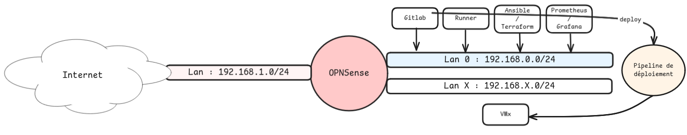

# Homelab

---

## 0. Schema



## 0.1 Todo

- [] **Homelab 🛠**  
  - [] **Proxmox**
    - [x] Install proxmox VE on mini-PC
    - [x] Create specific admin user
    - [x] Create terraform specific user (terraform-deploy) with sepcific roles
  - [] **Gitlab**
    - [x] Install Gitlab server
    - [x] Create specific admin user
    - [x] Create project for our deploy pipeline

---

## 1. Proxmox

### 1.1. Install proxmox VE

---

### 1.2. Terraform with Proxmox

Sources :
- Thank you, Stephane Robert for this ressource ! [blog.stephane-robert.info](https://blog.stephane-robert.info/docs/virtualiser/type1/proxmox/terraform/#configuration-de-proxmox)
- [dev.to](https://dev.to/marksie1988/proxmox-template-with-cloud-image-and-cloud-init-3660)

Role creation `TerraformProv` for specific Terraform user which we will use to deploy ressources on Proxmox

```bash
pveum role add TerraformProv -privs "Datastore.Allocate Datastore.AllocateSpace Datastore.Audit Pool.Allocate Sys.Audit Sys.Console Sys.Modify VM.Allocate VM.Audit VM.Clone VM.Config.CDROM VM.Config.Cloudinit VM.Config.CPU VM.Config.Disk VM.Config.HWType VM.Config.Memory VM.Config.Network VM.Config.Options VM.Console VM.Migrate VM.Monitor VM.PowerMgmt SDN.Use"
```

User creation `terraform-deploy`

```bash
pveum user add terraform-deploy@pve --password <password>
```

Role attribution for terraform-deploy user with specific permissions previously set on TerraformProv role.

```bash
pveum aclmod / -user terraform-deploy@pve -role TerraformProv
```

Token `Terraform token` generation. This one will be used to deploy ressources on Proxmox

```bash
pveum user token add terraform-deploy@pve terraform -expire 0 -privsep 0 -comment "Terraform token"
```

### 1.3. Template generation

We will generate a template VM to use it with our terraform-deploy token. 

```bash
apt install -y libguestfs-tools
```

Let's move on the Proxmox's iso directory

```bash
cd /var/lib/vz/template/iso
```

Download Ubuntu 20.04 server cloud image

```bash
wget https://cloud-images.ubuntu.com/releases/20.04/release/ubuntu-20.04-server-cloudimg-amd64.img
```

```bash
# This command show me network issues like DHCP configuraiton and DNS resolution fail
virt-customize -a ubuntu-20.04-server-cloudimg-amd64.img --install qemu-guest-agent
```

Change root's password

```bash
virt-customize -a debian-12-generic-amd64.qcow2 --root-password password:<password>
```

New virtual machine creation

```bash
qm create 10000 --name "debian12-template" --memory 2048 --cores 2 --net0 virtio,bridge=vmbr0
```

Setup tags to this virtual machine

```bash
qm set 10000 --tags "template,debian"
```

Setup disk on this new virtual machine

```bash
qm importdisk 10000 debian-12-generic-amd64.qcow2 local-lvm
```

Attach disk previously created

```bash
qm set 10000 --scsihw virtio-scsi-pci --scsi0 local:10000/vm-10000-disk-0
```

Add cloud-init drive

```bash
qm set 10000 --ide2 local-lvm:cloudinit
```

Make the cloudinit drive bootable

```bash
qm set 10000 --boot c --bootdisk scsi0
```

Add serial Console

```bash
qm set 10000 --serial0 socket --vga serial0
```

Turn on guest-agent

```bash
qm set 10000 --agent enabled=1
```

Turn on DHCP

```bash
qm set 10000 --ipconfig0 ip=dhcp
```

Template creation from our image

```bash
qm template 10000
```

---

### 1.4. Terraform with Proxmox PoC

Terraform file

```json
provider "proxmox" {
  endpoint = "https://<proxmox_ip>:8006/"
  api_token = var.api_token
  insecure = true
  ssh {
    agent = true
    username = "root"
  }
}
```

Create variables.tf file 

```json
variable "api_token" {
  description = "<token>"
  type = string
}
```

